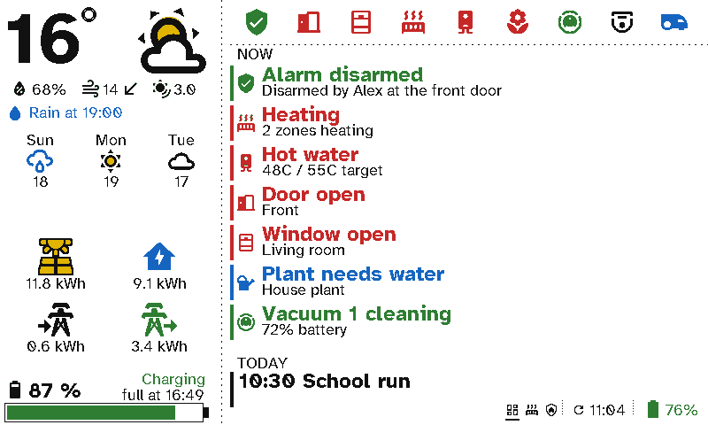
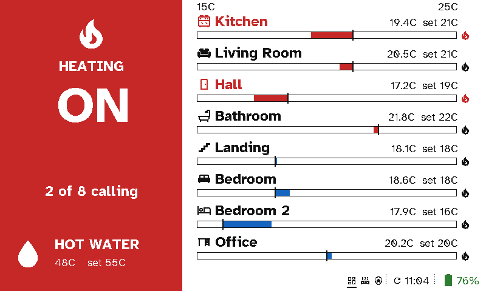
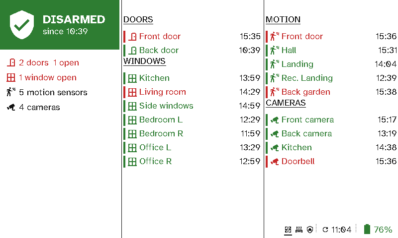
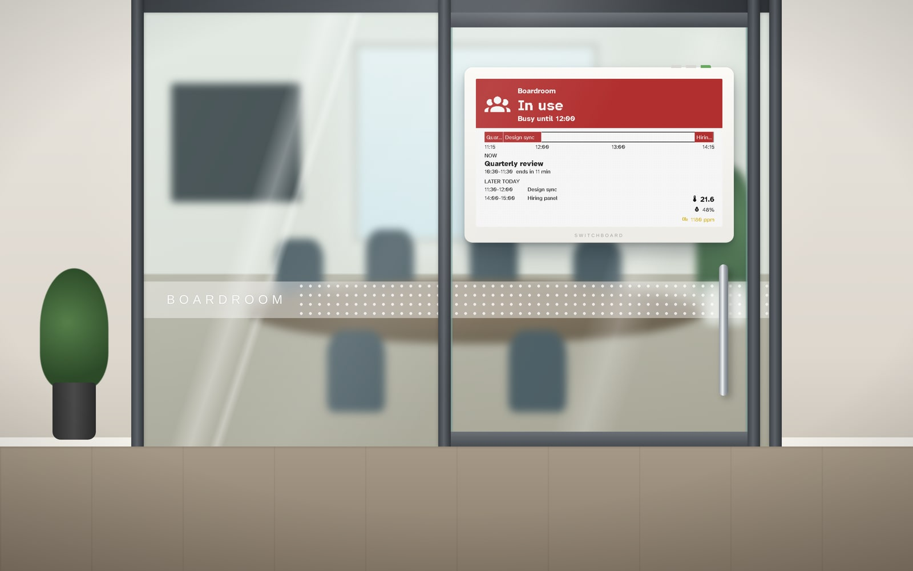
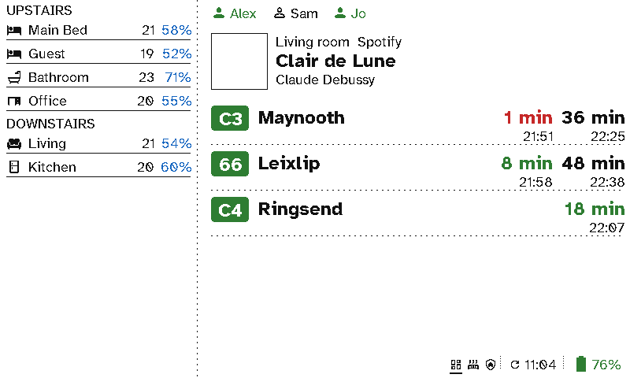
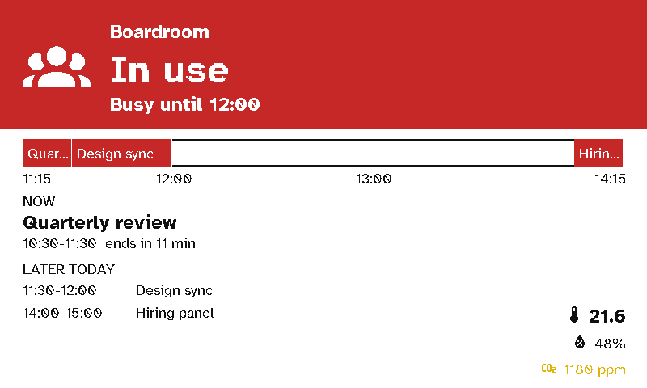

# Switchboard Viewport

**Your whole house on the wall, in colour, for months on a charge.**

Switchboard Viewport turns a **Seeed reTerminal E1002** into a Home Assistant wall display. The E1002 has a 7.3" Spectra 6 colour e-ink panel, three buttons and a battery. The display shows the weather, energy, heating, security, calendar, who's home and the next bus, and it reads from across the room like a printed page. There's no glow, no fan, no cable and no tablet to keep charged.

<p>
  
  
</p>
<p>
  
  
</p>

**[⚡ Flash it from your browser](https://stumarti.github.io/Switchboard/)** · **[Set one up](https://stumarti.github.io/Switchboard/manual/viewport/setup.html)** · **[See every screen](https://stumarti.github.io/Switchboard/manual/viewport/screens.html)**

## Around 3 months on a charge

E-ink holds its picture without using any power, so the display only needs power while it changes. The viewport spends nearly all its time in deep sleep:

- **It wakes, checks and sleeps.** It wakes on a timer set by the server, asks what changed and redraws only if something did. If nothing changed, the panel isn't touched at all.
- **It can refresh on the clock**, for example on the hour and at half past. Displays are staggered by a few seconds so they don't all hit the server at once.
- **It sleeps longer overnight.** During quiet hours it wakes only every 30 minutes to 4 hours, as you choose, and shows a small bed icon while they last.
- **The server does the thinking.** Every value, colour, icon and sentence arrives ready to draw, so the display never talks to Home Assistant.

The server learns how fast the battery drains and shows the **days left** on its Home page. It warns you well before the battery runs out, and can publish the battery, temperature and humidity to Home Assistant.

## What it shows

Build its screens in [Switchboard Server](https://github.com/stumarti/Switchboard-Server)'s layout builder, which has a live preview from Home Assistant. Pick from twenty section types and arrange them in one, two or three columns. The display picks up changes at its next refresh.

- **The kitchen dashboard:** the Status, Heating and Security screens from the panel's original firmware, drawn pixel for pixel the same (`test/compare` checks this).
- **Weather:** now, later and the next days, with colour icons. **Energy:** totals, and a graph of solar against its forecast and where your power went. **The home battery:** its charge, whether it's charging, and when it'll be full.
- **Heating:** each zone against its setpoint. **Security:** the alarm, doors and windows, motion and cameras. **Now:** whatever needs attention.
- **Calendar, people, now playing, room temperatures, bus and train departures, announcements**, plus a meeting room sign and a room finder for the office.
- **In the office:** a sign per meeting room, its calendar read straight from a Google Calendar, Outlook / Microsoft 365 or iCloud link, changing two minutes ahead of each meeting and quiet at nights and weekends. Paste a list of rooms into the server to set up a whole floor ([Viewports in the office](https://stumarti.github.io/Switchboard/manual/viewport/office.html)).

<p></p>
<sub>A render: a viewport on a meeting room's glass door, showing the screen as this firmware draws it.</sub>

<p>
  
  
</p>

## Easy to live with

- **Set up with your phone.** The panel shows two QR codes: one joins its hotspot, the other opens a page where you pick your Wi-Fi. Then approve it on the server.
- **Three buttons, the same on every screen:** left is previous, middle is next and the green one goes home. Hold left for device info, middle to clear the panel, and green for Wi-Fi setup.
- **It updates itself** over Wi-Fi from the server. Each update is checked by SHA-256 and board, and a new version rolls back on its own if it can't reach home.
- **Clear error screens** for no Wi-Fi, no server, no Home Assistant, and a battery that needs charging.
- **Make it yours:** swap any icon or the font from the server's Theme page.

## For developers

```sh
pio run -e e1002 -t upload -t monitor   # build and flash
./test/host/run.sh                      # logic tests, and every screen rendered to test/host/out/
./test/compare/compare.sh               # the original kitchen panel firmware vs this one, pixel for pixel
node test/compare/scenarios.js          # the same, across 60 Home Assistant scenarios
```

To release, push a tag: `git tag v0.1.0 && git push origin v0.1.0`. The release workflow publishes the whole flash image for USB (`switchboard-viewport-<tag>.bin`) and the over-the-air image (`switchboard-e1002-app-<tag>.bin` and its `.sha256`). It also updates the browser flasher. The server lists these releases under **Settings → Remote updates**.

See [Building the firmware](https://stumarti.github.io/Switchboard/manual/viewport/building.html) in the manual for the source layout.

Part of [Switchboard](https://github.com/stumarti/Switchboard), with the X4 Pro remote and [Switchboard Server](https://github.com/stumarti/Switchboard-Server).
